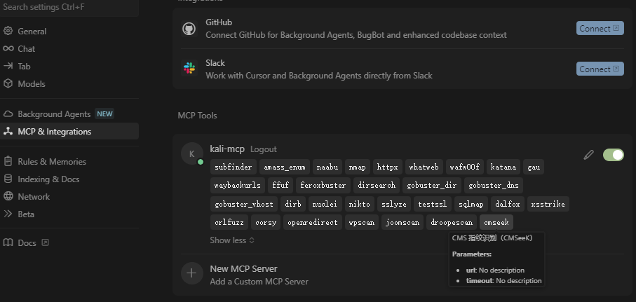
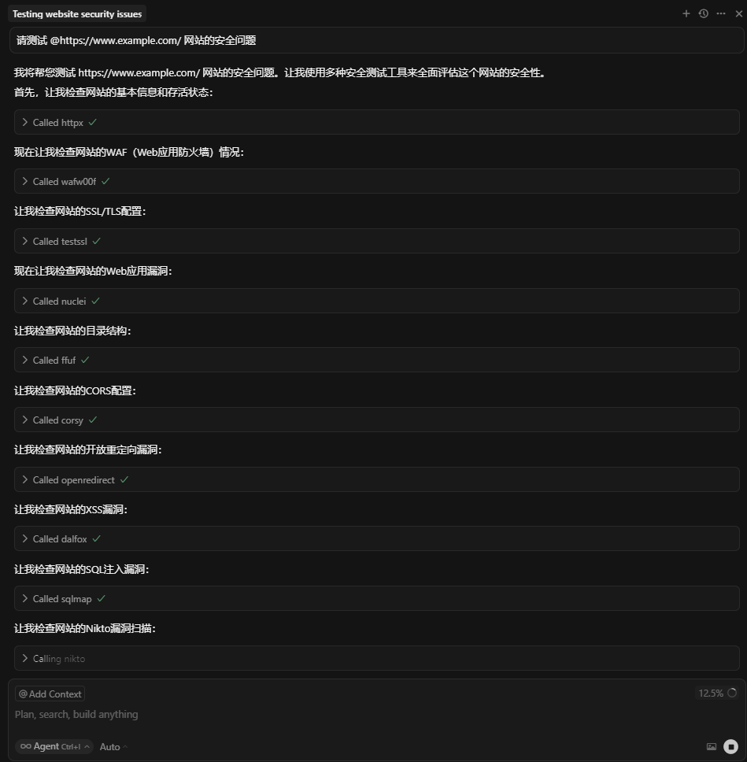

<h1 align="center">⚡ KALI_MCP_SERVER ⚡</h1>
<p align="center">
  <b>Config-Driven Security Automation Hub</b><br/>
  <i>Single JSON-RPC 2.0 entrypoint · Declarative tool engine · Docker-only deployment</i>
</p>

<p align="center">
  
  
  
</p>

<p align="center">
  <!-- Demo screenshot placeholder -->
  
</p>
<p align="center">
  <!-- Demo screenshot placeholder -->
  
</p>

---

## ✨ Features

- ✅ Declarative tool definition in `config.json`
- ✅ Async jobs with live logs (SSE / polling)
- ✅ Self-describing `/capabilities_ext`
- ✅ Secure with API key 🔑

---

## 🧰 Supported Tools

Built-in penetration testing tools (preinstalled in Docker image):

- 🔍 **Port/Service Scan**: `nmap`
- 🌐 **Web App Testing**: `sqlmap`, `wpscan`, `nikto`, `whatweb`, `dirb`, `dirsearch`, `feroxbuster`, `gobuster`
- 🕵 **Reconnaissance**: `amass` (subdomain enum)
- 🔒 **SSL/TLS Analysis**: `sslyze`, `testssl.sh`
- 🛡 **WAF/Middleware**: `wafw00f`, `joomscan`
- ⚡ **Fuzz & Bruteforce**: `ffuf`
- 🐍 **Python Toolkits**: via `python_tools.sh`
- 🏗 **Go Toolkits**: via `go_tools.sh`
- 📂 **Wordlists & Templates**: `wordlists.sh`, `nuclei_templates.sh`

Extension:

- Add custom installer in `extras-installer/modules/`
- Declare tools in `config.json`
- Verify via `/capabilities_ext`

---

## 🚀 Quick Start (Docker Compose)

```bash
git clone <repo-url>
cd KALI_MCP_SERVER
cp .env.example .env
docker compose up -d --build
```

👉 Health check:

```bash
curl -H "x-api-key:your-secret-key" http://127.0.0.1:8080/health
```

---

<details>
<summary>📂 Directory Layout</summary>

```
extras-installer/   # optional extra tool installers
mcp_server.py       # FastAPI + JSON-RPC
config.json         # tool declarations
Dockerfile
docker-compose.yml
.env
```

</details>

---

## 🛠 Operations

### 🔗 Endpoints

- `POST /` → JSON-RPC (`initialize`, `tools/list`, `tools/call`)
- `GET /jobs/{job_id}/sse` → Live logs
- `GET /jobs/poll` → Poll logs
- `POST /jobs/cancel` → Cancel job
- `GET /capabilities_ext` → Tool registry
- `GET /health` → Health probe

### 📜 Call Example

**List tools**

```bash
curl -X POST http://127.0.0.1:8080/   -H "content-type: application/json" -H "x-api-key: your-secret-key"   -d '{"jsonrpc":"2.0","id":1,"method":"tools/list","params":{}}'
```

**Async call**

```bash
curl -X POST http://127.0.0.1:8080/   -H "content-type: application/json" -H "x-api-key: your-secret-key"   -d '{"jsonrpc":"2.0","id":"job1","method":"tools/call","params":{"name":"nmap_scan","arguments":{"host":"scanme.nmap.org","async":true}}}'
```

---

## 🖥 Integrate with Cursor

Add to `~/.cursor/mcp.json`:

```json
{
  "mcpServers": {
    "kali-mcp": {
      "url": "http://localhost:8080",
      "timeout": 0,
      "headers": { "x-api-key": "your-secret-key" }
    }
  }
}
```

---

<a id="中文"></a>

<h1 align="center">🌏 中文版本</h1>


### ✨ 特点

- 声明式工具定义（`config.json`）
- 同步/异步调用，实时日志（SSE）
- `/capabilities_ext` 自动列出工具与二进制版本
- 可选 `x-api-key` 鉴权 🔐

---

### 🧰 支持工具

内置常用渗透测试工具（Docker 镜像预装）：

- 🔍 **端口/服务探测**：`nmap`
- 🌐 **Web 应用测试**：`sqlmap`、`wpscan`、`nikto`、`whatweb`、`dirb`、`dirsearch`、`feroxbuster`、`gobuster`
- 🕵 **信息收集**：`amass`（子域名枚举）
- 🔒 **SSL/TLS 检测**：`sslyze`、`testssl.sh`
- 🛡 **WAF/中间件**：`wafw00f`、`joomscan`
- ⚡ **模糊测试/爆破**：`ffuf`
- 🐍 **Python 工具集**：通过 `python_tools.sh` 安装
- 🏗 **Go 工具集**：通过 `go_tools.sh` 安装
- 📂 **字典/模板**：`wordlists.sh`、`nuclei_templates.sh`

扩展能力：

- 在 `extras-installer/modules/` 新增自定义安装脚本
- 在 `config.json` 声明新工具
- 通过 `/capabilities_ext` 自动检测二进制可用性与版本

---

### 🚀 快速开始

```bash
docker compose up -d --build
```

👉 健康检查：

```bash
curl -H "x-api-key:your-secret-key" http://127.0.0.1:8080/health
```

---

### 🔗 接口列表

- `POST /` → JSON-RPC (`initialize`、`tools/list`、`tools/call`)
- `GET /jobs/{job_id}/sse` → 实时日志
- `GET /jobs/poll` → 轮询日志
- `POST /jobs/cancel` → 取消任务
- `GET /capabilities_ext` → 工具能力
- `GET /health` → 健康检查

---

### 🖥 在 Cursor 中接入

在 `~/.cursor/mcp.json` 添加：

```json
{
  "mcpServers": {
    "kali-mcp": {
      "url": "http://localhost:8080",
      "timeout": 0,
      "headers": { "x-api-key": "your-secret-key" }
    }
  }
}
```

---

## 📜 License

MIT
